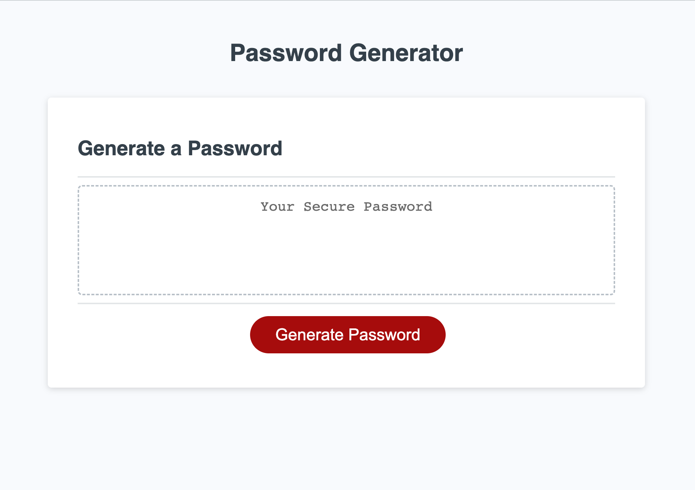
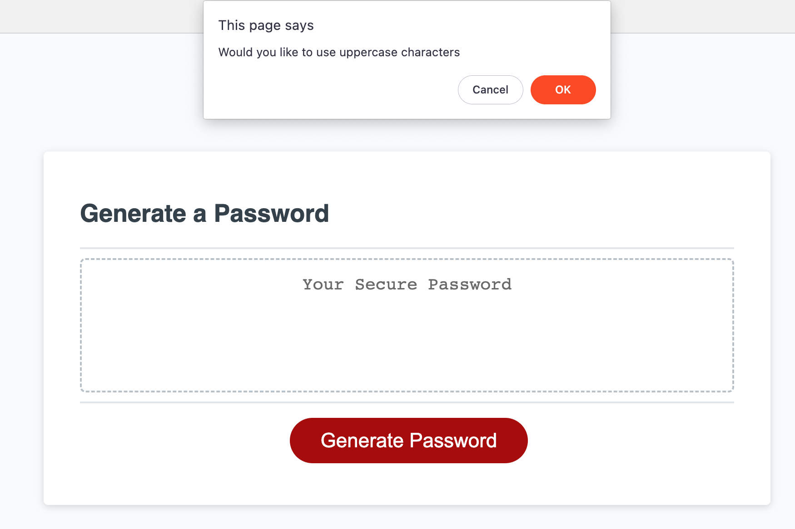
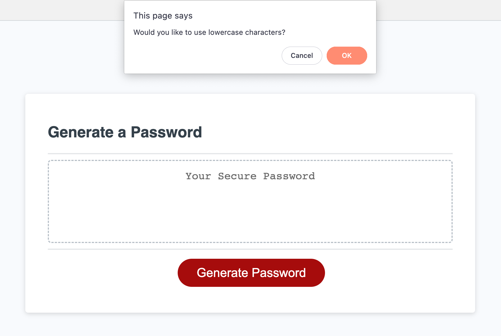
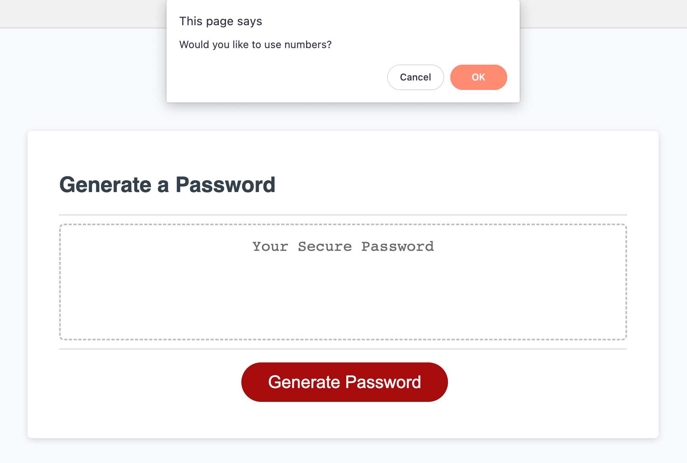
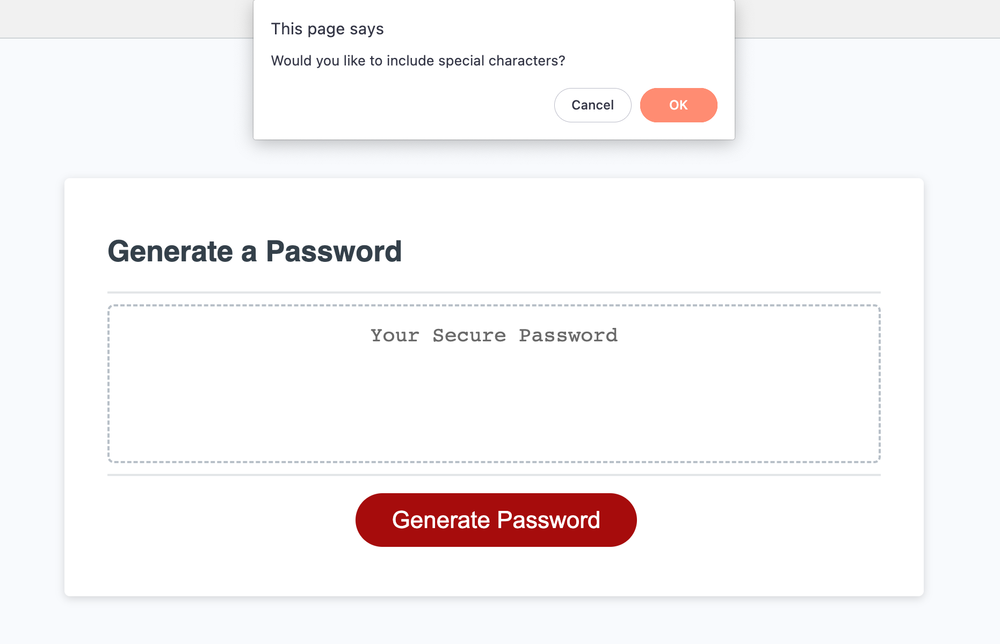
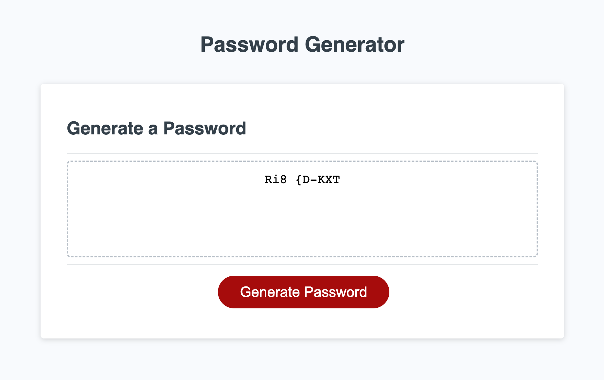

# Module3-Challenge

## Technology Used 

| Technology Used         | Resource URL           | 
| ------------- |:-------------:| 
| HTML    | [https://developer.mozilla.org/en-US/docs/Web/HTML](https://developer.mozilla.org/en-US/docs/Web/HTML) | 
| CSS     | [https://developer.mozilla.org/en-US/docs/Web/CSS](https://developer.mozilla.org/en-US/docs/Web/CSS)      |   
| Git | [https://git-scm.com/](https://git-scm.com/)     |    

## Description 

- This is a secure password generator that is easy to use to generate a secure password between 8 and 128 characters. 
- It is customizable and can choose between upper case letter, lower case letter, numbers and special characters.  
- The secure password generator is secure because it randomly selects from the user's input and requires at least 8 characters which is proven to strengthen passwords.
- It taught me a lot about if and for loops that I used to create and return the string of random characters.

[Secure Password Generator](https://gypsyboho.github.io/Module3-Challenge/)

## Usage 

To use the password generator 
- click on the "Generate Password" button
- type in the number of characters you want in your password. It must be between 8 and 128 characters
- decide if you want upper case letters, lower case letters, numerical characters and or special characters to be included in the password
- you should see the randomly generated password appear within the window once you have cycled through all the choices

## Credits

I'd like to credit my classmates for help and w3schools.

## License

NA